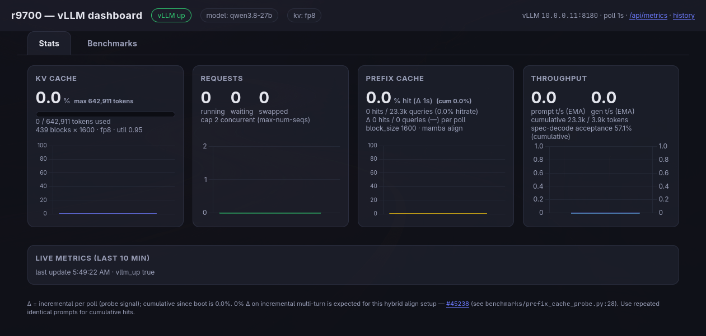

# vLLM on Radeon AI PRO R9700

Build and run vLLM from source for AMD Radeon AI PRO R9700 GPUs. The default
configuration targets two R9700s (`gfx1201`) and serves a model through vLLM's
OpenAI-compatible API.

Project goal, in order: **stability first, performance second**. This stack
serves real work traffic, so correctness and uptime outrank benchmark wins —
tuning is accepted only when it doesn't regress reliability.

## Requirements

- Docker with the Compose plugin (`docker compose`), or Podman (`podman
  compose`); `just` recipes default to Docker (Podman caveats below)
- [`just`](https://just.systems/)
- [`git`](https://git-scm.com/) (to fetch the source)
- SELinux hosts need no special relabeling: bind mounts mount unlabeled because
  the container runs with `label=disable`
- One or more R9700 GPUs; the included configuration assumes two

**Podman caveats** (verified on podman 5.7 / buildah 1.42):
- Runtime ops (`up`/`down`/`logs`/`run`/`exec`) need the podman API service
  running — `systemctl --user enable --now podman.socket` (or
  `podman system service &`). Without it, `podman compose` fails to connect
  to `/run/user/$UID/podman/podman.sock`. `just check` (config only) works
  without it.
- Builds work, but buildah silently ignores `RUN --mount=type=cache` (the
  target dir is pre-created but not shared across steps), so `just rebuild`
  loses pip/ccache cache reuse and runs slower than the Docker estimate.

## Quick start

Get the source (skip if you already have the repo checked out; all commands
below run from inside it):

```sh
git clone https://github.com/prcoe1/r9700-serving.git
cd r9700-serving
```

```sh
cp .env.example .env  # Build version pins + default model profile (untracked)
just build       # Build localhost/vllm-fullbuild:latest
just check       # Validate the compose config for the selected profile
just up          # Start vLLM in the background (default: Qwen3.8-27B-FP8) + dashboard on :8083
just --set model qwen3.6-27b up     # Switch to Qwen3.6-27B-FP8 (dense)
just --set model qwen3.6-35b-a3b up  # Switch to MoE 35B-A3B model
just logs        # Follow service logs
just down        # Stop and remove containers (server + dashboard)
just dashboard-down # Stop only the dashboard (`up` restarts it)
just logs-dashboard # Follow dashboard logs
```

To use Podman: `just --set runtime podman build` or `RUNTIME=podman just up`
(see the Podman caveats in Requirements). Run `just --list` to see all recipes
including `rebuild` (force-rebuild), `clear-vllm-caches` (wipe host-side
Triton/Inductor/AITER caches; preserves the HuggingFace model cache),
`dashboard-up` (standalone start), and `dashboard-down` (standalone stop).

Always go through `just`: `compose.yaml` interpolates the model arguments from
`env/<profile>.env`, which the recipes pass to compose via `--env-file`. A bare
`docker compose up` fails with a required-variable error rather than starting a
server with no model.

The vLLM OpenAI-compatible API is available at `http://localhost:8180/v1`.
Other containers on the same compose network can reach it via the `llm-backend`
network alias instead of the host port.

## Configuration

Build versions are pinned in `.env` (untracked; copy `.env.example` to create it).
Host-specific settings also live there: `USER_UID`/`USER_GID` (the user the
container runs as, keeping host cache dirs user-owned) and `RENDER_GID` (the
host render group gid for `/dev/dri` access — check with `getent group render`).

| component    | version |
|:-------------|:--------|
| ROCm         | 10.0.0 (`rocm/dev-ubuntu-24.04:10.0.0-full`, Python 3.12) |
| PyTorch      | 2.13.0+rocm10.0.0 (`stable.repo.amd.com/whl-next`, `torch[device-gfx1201]`) |
| vLLM         | 0.31.0rc3 (+ carried #58021 — verified NOT in rc3 nor final, behavior-neutral here) |
| AITER        | v0.1.24.post1 |
| Flash Attention | @ 1cc7ff67 (source; official guide uses `flash-attn==2.8.3` wheel) |

ROCm 10.0 is the TheRock 10.0 stream (successor to the 7.9/7.13/7.14 previews); the
production 7.2.x line lacks RDNA4/`gfx1201` support. AITER `v0.1.24.post1` carries
the RDNA unified-attention LDS guard (#4868) and the UA config-tree
tuning tables; vLLM 0.31.0rc3 carries the hybrid prefix-cache family
(#54713, #55450, #55390, #58368, #59146, #59175), the draft-backend override
(#54826), the trailing-block-drop opt-out (#53388), the last-block replay
(#53945), GDN warmup (#54251), W4A16 packed zero-points (#54965), multimodal
prefix-cache worker paths (#54994), incremental multimodal block hashing
(#51694), source-tagged prefix-cache extra keys (#51899), the GDN
stateless-chunk fix (#51565), the MRV2 padded-tail fix (#58434),
padded-tail Mamba state (#55178), and the Quark W4A16 loader (#48606) — all formerly carried as local
patches, all dropped on the v0.31 bump (see AGENTS.md §4).
Post-rc3 #58021 still rides as a local patch (source-only,
behavior-neutral — no profile passes `--prefix-match-unit`; verified NOT in
rc3 nor the v0.31.0 final, which was separately skipped as out-of-scope —
see AGENTS.md "Checking for Updates"). Official vLLM-on-ROCm guide uses Python 3.14 + `torch[device-gfx1201]==2.13.0+rocm10.0.0`
`torchvision[device-gfx1201]==0.28.0+rocm10.0.0` `torchaudio==2.11.0+rocm10.0.0` via
`--index-url https://stable.repo.amd.com/rocm/whl-next/` and `flash-attn==2.8.3`
`amd-aiter==0.1.23` via `--extra-index-url https://rocm.frameworks.amd.com/whl-multi-arch/vllm/`.

The default (active) model is `Qwen/Qwen3.8-27B-FP8` (`qwen3.8-27b`, the
newest dense 27B hybrid linear/full-attention architecture, MTP trained,
vision). Alternatives: `Qwen/Qwen3.6-27B-FP8` (`qwen3.6-27b`, dense),
`Qwen/Qwen3.6-35B-A3B-FP8` (`qwen3.6-35b-a3b`, 35B total / 3B active MoE),
and `cyankiwi/Qwen3.8-27B-AWQ-BF16-INT4` (`qwen3.8-27b`, compressed-tensors
W4A16 weight-only trial — decode-optimized alternative, MTP3 via a local
HF-config snapshot (upstream `#53387` workaround) with calibrated fp8 KV
when spec decode is on (currently off, mirroring live; rollback one-liner
in `env/qwen3.8-27b-awq.env`);
earlier Quark trial in
[`benchmarks/2026-09-10_qwen3.8-27b_awq_trial.md`](benchmarks/2026-09-10_qwen3.8-27b_awq_trial.md)).
Model selection is controlled by `MODEL_PROFILE` in `.env` — override inline
with `MODEL_PROFILE=qwen3.6-27b just up`.

Runtime environment is split across files:
- `env/2xr9700.vllm.common` — two-GPU ROCm config (arch, NCCL, HSA, compile caches)
- `env/aiter-unified-attention.env` — enables AITER unified attention only
- `env/qwen3.6.env.common` — shared qwen3.6/3.8 config (KV cache dtype, MTP spec-decode, tool choice)
- `env/qwen3.6-35b-a3b.env` — MoE model config (path, tokenizer,
  `--max-num-batched-tokens 4096` cap)
- `env/qwen3.6-27b.env` — dense 27B model config
- `env/qwen3.8-27b.env` — Qwen3.8-27B-FP8 dense model config (same
  architecture as 3.6-27B, so it shares the 3.6 common settings and tuned
  per-shape fp8 GEMM configs)
- `env/qwen3.8-27b-awq.env` — AWQ-INT4 trial profile (same settings as
  qwen3.8-27b, fp8 KV with calibrated scales, MTP3 via the HF-config snapshot);
  see the trial doc above

### Chat template

All profiles mount and use [froggeric's Qwen-Fixed-Chat-Templates]
(`chat-templates/qwen.jinja`, pinned to **v22.5** — `qwen3.8-froggeric-v22.5`,
fetched from the repo's `main`). It is applied to every model via `--chat-template` in `compose.yaml`,
overriding each model's bundled template. It fixes rendering bugs, KV-cache
invalidation, and token waste in the official Qwen templates, and adds
tool-error retry warnings plus `tool_call_format` / `reasoning_effort` kwargs.
Since **v22.4** (retained in v22.5), history re-rendering is byte-identical to generated tokens on
thinking-off turns, which keeps `--enable-prefix-caching` hits intact across
multi-turn conversations (this stack runs thinking-off). Thinking is
partitioned into the `reasoning` field and the answer into `content`;
`--reasoning-parser qwen3` is required for the split. v22.5 additionally
conditions the tool-call instruction's `<think>` block on `enable_thinking`
(fixes spurious `<think>` when thinking is off) and avoids truncating JSON
`tool_response` payloads.

Refresh the overlay from upstream when a newer version ships (compare the
`template_version` line of `chat-templates/qwen.jinja` against the repo's
`main`):

```sh
curl -L -o chat-templates/qwen.jinja \
  https://huggingface.co/froggeric/Qwen-Fixed-Chat-Templates/raw/main/chat_template.jinja
```

Template bumps need no image rebuild: after refreshing, bump the pin note
above and `just down && just up` (the in-memory prefix cache is cleared on
restart anyway).

[froggeric's Qwen-Fixed-Chat-Templates]: https://huggingface.co/froggeric/Qwen-Fixed-Chat-Templates

### Non-standard vLLM flags

- **`--enable-auto-tool-choice --tool-call-parser qwen3_coder
  --reasoning-parser qwen3`** (`VLLM_TOOL_CHOICE`, all profiles): OpenAI
  tool-calling with Qwen's `qwen3_coder` parser; `--reasoning-parser qwen3` is
  required for the template's `reasoning`/`content` split.
- **`--limit-mm-per-prompt '{"image": 99, "audio": 0, "video": 0}'`**: up to
  99 images per prompt, audio/video disabled. Previously capped at 1 to block
  the 2+-large-images engine deadlock on these GDN hybrids (upstream #40707,
  see AGENTS.md watchlist): with 2+ large images the align block-split
  collapses to 0, the request hangs forever, and the engine never recovers.
  The upstream fix #40709 is now carried as a local build patch
  (`patches/vllm/40707-mamba-block-aligned-split-deadlock.patch`, live since
  the 2026-09-19 rebuild — verified with `benchmarks/multi_image_probe.py`);
  drop it when a pinned `VLLM_REF` contains the fix.
- **`--override-generation-config`**: server-side sampling defaults
  (`temperature` 1.0, `top_p` 0.95, `top_k` 20, `min_p` 0, no penalties).
- **`--enable-prefix-caching`**: reuse KV for shared prompt prefixes (known
  limitations on this hybrid — AGENTS.md watchlist).
- **`--max-model-len`** (`VLLM_MAX_MODEL_LEN`, 131072 everywhere — compose
  default, pinned explicitly by qwen3.8-27b),
  **`-tp 2`**, **`--gpu-memory-utilization 0.95`** (`VLLM_GPU_MEM_UTIL`,
  single-tenant default; lower to 0.92 when a GPU co-tenant such as whisper.cpp
  is active so it keeps ~2-3 GiB of VRAM headroom), **`--max-num-seqs`**
  (compose default 2 — the #35288 cap; qwen3.8-27b raises it to 4 for the
  MTP-off experiment below, which is safe because #35288 needs MTP).
- **`--kv-cache-dtype`** (`VLLM_KV_CACHE_DTYPE`): **fp8 on qwen3.8-27b**
  (the live default), served from the calibrated local copy that `just up`
  builds via `ensure-kvscales` — the stock checkpoints ship no KV scales and
  uncalibrated scale-1.0 is miscalibrated (deep-layer V amax ~132 vs the
  ~1-24 range scale 1.0 assumes). The 3.6 profiles run **bf16 KV** (higher K/V
  fidelity at the cost of KV bytes; the AITER bf16 LDS posture now comes from
  upstream #4868 plus the narrowed small-Q guard in
  `patches/aiter/unified-attention-gfx1201-tune.patch`), with a
  calibrated fp8 sidecar already on disk for 3.6-27b as the opt-in path when
  context length is the binding constraint. Calibration history:
  [`benchmarks/2026-08-22_kv_calibration_quality_ab.md`](benchmarks/2026-08-22_kv_calibration_quality_ab.md).
- **`--attention-backend ROCM_AITER_UNIFIED_ATTN`** + `--speculative-config`
  (MTP4 on both Qwen3.6 profiles via `qwen3.6.env.common`). Qwen3.8-27B
  peaked at **MTP3** (its MTP head accepts drafts poorly past position 3 —
  bf16-KV sweep: MTP3 57.6, MTP2 56.0, MTP1 45.6, MTP4 49.2, no-MTP 32.0
  tg32) but currently runs with spec decode **disabled** (10-03 operator
  decision — `VLLM_SPEC_DECODE` empty, `VLLM_MAX_NUM_SEQS=4`; rollback to
  MTP1 is a one-liner in `env/qwen3.8-27b.env`). DFlash2 was rejected
  after a 2026-08-22 depth A/B (decode win is short-context only, decays
  with depth) — see [`archive/DEADENDS.md`](archive/DEADENDS.md).

### Runtime overlays (bind-mounted source fixes)

Version-locked patches applied at runtime by read-only bind-mounts in
`compose.yaml` (no image rebuild needed). Refresh the overlay files when bumping
the pinned dependency.

- **Tolerate empty `tools` arrays** (`patches/vllm/protocol.py`, overlay of
  upstream at `VLLM_REF` v0.31.0rc3 — base verified byte-identical on rc3
  (only the tolerance hunk differs); rc2 reworked
  sampling-params resolution (user → server default → OpenAI default) and
  `presence/frequency_penalty` None-defaults (#50769): some clients send `{"tools": [], "tool_choice":
  "none"}`, which upstream rejects with a 400. The overlay treats `tools: []`
  as a no-tools request when `tool_choice` is `"none"`/omitted, while still
  rejecting genuinely invalid combos.

### Source-build patches (applied at image build time)

Local backports of upstream fixes not in `VLLM_REF` v0.31.0rc3, applied by
`Dockerfile.fullbuild` from `patches/vllm/*.patch` (mirrors the aiter patch
loop). Re-verify each patch applies cleanly on the new ref when bumping
`VLLM_REF` — and drop any whose fix has since landed (see
AGENTS.md §4). Retired patches stay in `archive/patches/` (#51812/#51837
dropped at v0.28.0, #53877 at v0.29.0, 47137-content at v0.30.0, #48606 at
v0.30.1rc0, #58368 at v0.31.0rc2; #58021 verified NOT in rc3, still carried.)

- **Honor `drop_eagle_block` in `MambaManager`**
  (`48375-mamba-drop-eagle-block.patch`, open upstream): without it, MTP +
  prefix caching on hybrid GDN can leave the final matched page holding
  recurrent state written over rejected draft positions — silent corruption
  on every later request sharing the prefix (#43559, #50188). Lowers the
  cache-hit search ceiling by one page. Version-locked to v0.31.0rc3.

- **Seed align-mode Mamba `state_idx` in Mamba blocks**
  (`53798-mamba-align-resume-seed.patch`, open upstream): without it, a
  request resumed with `num_computed_tokens>0` seeds its align-table column
  with the scheduler block size instead of `MambaSpec.block_size`, landing
  in a neighbour's row or past the table (IMA in
  `precopy_mamba_align_fused_kernel`). Version-locked to v0.31.0rc3
  (neighbouring `#58434`/`#59175`/`#51899` hunks verified disjoint).

- **Restore prompt-tail prefix-cache hits with MTP** — DROPPED with the
  v0.31.0rc2 bump (#58368 is in rc2, now rides stock).

- **Reject a `prefix_match_unit` a single KV group cannot honor**
  (`58021-prefix-match-unit-single-group.patch`, merged to main 2026-09-29 —
  verified NOT in rc3 nor the v0.31.0 final): without it, a single-group run
  with an explicit `--prefix-match-unit` lets the Mamba prefill checkpoint
  builder write checkpoints off the scheduler's grid (silent wrong-state
  resumes). Source-only carry; behavior-neutral here — no profile passes the
  flag. Drop when a pinned `VLLM_REF` contains the merge.

- **Fix `_mamba_block_aligned_split` deadlock on 2+ large images**
  (`40707-mamba-block-aligned-split-deadlock.patch`, verbatim upstream fix
  `#40709`, open): without it, 2+ large images in one prompt hang the request
  forever (align block-split collapses to 0). Live since 2026-09-19,
  verified with `benchmarks/multi_image_probe.py`. Drop when a pinned
  `VLLM_REF` contains the fix.

- **Streaming/non-streaming tool-parser parity on truncated tool calls**
  (`47137-tool-truncation-parity.patch`; content half fixed upstream by
  #47562, args half still open as #48007): without it, a tool call cut short
  by `max_tokens`/`stop` returns dropped (`{}`) arguments non-streaming while
  streaming clients already received the partial args. Engine-parsers only
  (`qwen3_coder`). Guard: `benchmarks/tool_truncation_probe.py`. Note: since
  rc0, streaming truncated calls gate to `finish_reason='length'` while
  non-streaming still stamps `'tool_calls'` (upstream #46303 inconsistency —
  first observed on the rc2 bump, not a regression). Drop when a pinned
  `VLLM_REF` contains the #48007 equivalent.

- **Qwen3 parser drops malformed `<parameter>` elements instead of leaking
  them** (`55497-qwen3-malformed-parameter-drop.patch`, fix #55497 open +
  conflicting, in no release): when the model writes a slightly-off
  `<parameter=>` element, the streamed partial converter swallowed everything
  up to the closing tag's `>` as a key while the final conversion did not —
  unterminated non-JSON `arguments` string, raw tags in content (seen live
  2026-10-01). Both upstream commits carried source-only. Guard: the
  complex-values check in `benchmarks/tool_truncation_probe.py`. Drop when a
  pinned `VLLM_REF` contains the merge.

- **Qwen3 parser/template agreement on thinking-off**
  (`qwen3-thinkoff-kwarg-parity.patch`, no upstream fix): the template
  pre-closes `<think>` for `reasoning_effort` none/off, but `Qwen3Parser`
  only read `enable_thinking` — thinking-off-by-any-other-route stranded the
  answer in `reasoning` (`content=None`). Guard:
  `benchmarks/thinkoff_probe.py`. Drop when a pinned `VLLM_REF` derives
  `thinking_enabled` from the same kwargs.

- **Native Quark W4A16 INT4/UINT4 export loading** — DROPPED with the
  v0.30.1rc0 bump (#48606 is in the rc; retired patch in `archive/patches/`).

- **Skip `libtorch_cpu` RTLD_GLOBAL promotion when `rocm_sdk` is installed**
  (`56190-rocm-skip-libtorch-global-promotion.patch`, no upstream fix): the
  v0.30.0 profiler fix preloads `libtorch_cpu.so` globally at `import vllm`,
  but TheRock's static LLVM then double-registers `cl::opt` options
  (`spirv-expand-step` → LLVM ERROR → abort, exit 139, crash-loop before
  logging). Costs only unused kineto GPU-profiling. Version-locked to
  v0.31.0rc3. If startup crash-loops with no logs on any bump, check
  `import vllm` in a throwaway container first.

- **RDNA4 FlyDSL block-FP8 GEMM** (`56005-rdna4-fp8-flydsl-gemm.patch`, not in
  v0.31.0rc3): vLLM-owned FlyDSL WMMA kernel family replacing the Triton
  block-scaled FP8 GEMM on gfx1200/gfx1201. Requires `flydsl 0.3.4.1` at
  runtime (`FLYDSL_VERSION` in `.env`). Live since 2026-09-24 — server log
  selects `RDNA4Fp8BlockScaledMMKernel`. Drop when a pinned `VLLM_REF`
  contains the merge (and still ships the gfx1201 variants).

- **Native HIP RDNA custom all-reduce** (`57767-rdna-all-reduce.patch` +
  `57767-v030-port.patch`, not in v0.31.0rc3): HIP/C++ custom all-reduce for
  RDNA (gfx1100/1200/1201) with a `VLLM_ROCM_USE_RDNA_ALL_REDUCE` opt-in.
  **Compiled but dormant**: this board exposes no P2P, so it falls back to
  PYNCCL; the flag stays unset. Drop when a pinned `VLLM_REF` contains the
  merge.

- **Stop mamba align prefill at the replay boundary**
  (`50409-mamba-replay-boundary-chunk-stop.patch`, open, in no tag): exact
  block-multiple prompts cache their only Mamba state at `num_tokens`, which
  `get_computed_blocks` caps below → 0-token Mamba hit. **Measured inert
  here** (`max_num_batched_tokens=1024` < 1600 block — the replay stop always
  coincides with existing stops). Kept: 13 lines, binds correctly if the
  chunk cap ever grows past the block size. Drop when a pinned `VLLM_REF`
  contains the merge.

- **Key the AOT compile cache on `limit_mm_per_prompt`**
  (`50891-mm-cap-compile-cache-key.patch`, open issue, no upstream PR):
  `ModelConfig.compute_hash()` ignored the image caps, so runs with different
  caps collided on one torch-compile cache entry and crashed in `profile_run`.
  Own fix: keys the folded `multimodal_config.limit_per_prompt` explicitly
  (dropping the ignore entry alone is a silent no-op — caps arrive as an
  InitVar). Behavior-neutral here (all runs share cap 99). Drop when a pinned
  `VLLM_REF` keys the compile cache on the multimodal config.

### AITER source-build patches (applied at image build time)

`Dockerfile.fullbuild` applies `patches/aiter/*.patch` to the pinned
`AITER_REF` (v0.1.24.post1, TheRock 10.0) before building the wheel. Together they make aiter's
unified attention work and run well on RDNA4 (`gfx1201`):

- **`unified-attention-gfx1201-tune.patch`** — per-arch launch-config tuning
  for gfx1201, expressed as additive keys in the v0.1.24 per-arch JSON
   config tree (`aiter/ops/triton/configs/gfx1201/triton/attention/
   unified_attention/DEFAULT.json`; upstream entries untouched). v0.1.24
   touches no UA/config-tree files (9 commits, all gfx950/Gluon/GEMM) and
   the table is byte-identical to v0.1.23, so the tuning trivially still
   wins — no `tune_ua_config.py` re-run on the bump. Same on the v0.1.24.post1
   bump (post1 touches no gfx1201 UA files — gemm/conv/mla tables only;
   both aiter patches apply clean, verified 2026-10-02). 3D decode
  (`D_LEQ_256.DT_any_bf16`, where head-256 bf16 decode lands):
  `num_warps` 2 → 4, `waves_per_eu` 2 → 6 — **~1.4–1.9× faster** at
  16k–128k context, bitwise-identical, for both bs=1 and the MTP
  batch-decode shape. 2D large-prefill (`Q_GEQ_256.DT_bf16_bf16`):
  `num_warps` 4 → 8, ~7% on the attention prefill kernel. Plus a narrowed
  LDS guard (`Q_LEQ_1.DT_any_bf16`, `TILE_SIZE_MAX` 64 → 32): upstream
  #4868 bounds the prefill bucket but leaves the small-Q 2D bucket at 64,
  which stages 2·64·256·2+scratch > 64 KiB for head-256 bf16 (the exact
  [ROCm/aiter#4329](https://github.com/ROCm/aiter/issues/4329) shape).
  These are attention-kernel wins; end-to-end decode is dominated by the 48
  GDN layers + MTP + TP, so the system-level effect is within noise (see
  the tuning doc). See
  [`benchmarks/2026-08-25_gfx1201_ua_tuning.md`](benchmarks/2026-08-25_gfx1201_ua_tuning.md)
  for the full sweep. The retired code-level bf16-KV cap
  (`unified-attention-bf16-kv.patch`, superseded by #4868 and unappliable
  since the config-tree refactor) is kept in `archive/patches/` for
  archaeology.
- **`allowed-archs-gfx1201.patch`** — accept gfx1201 (and the rest of the RDNA
  family) in `csrc/cpp_itfs/utils.py` `allowed_archs` so a
  `GPU_ARCHS=gfx1201` build-time prebuild path doesn't hard-assert (matches the
  runtime JIT list in `aiter/jit/core.py`; inert here since this repo runs
  `PREBUILD_KERNELS=0`).

Re-verify each patch applies cleanly on the new ref when bumping `AITER_REF`
(they are version-locked to v0.1.24; verified `git apply --check` clean on `v0.1.24` 2026-09-28).

### Runtime env knobs

Non-standard environment set across `compose.yaml`, `Dockerfile.fullbuild`,
and `env/2xr9700.vllm.common` (loaded via `env_file`):

| var | value | why |
|:----|:------|:----|
| `GPU_MAX_HW_QUEUES` | `1` | required: multiple queues cause a 55-63% decode regression on RDNA4 |
| `NCCL_P2P_DISABLE` | `1` | required on this host: the GPUs sit on separate PCIe root ports, and enabling P2P collapses decode ~10× even though RCCL establishes P2P channels (also rules out the P2P all-reduce HIP kernels) |
| `NCCL_MIN/MAX_NCHANNELS` | `4` | bandwidth sweet spot for two PCIe 5.0 x8 root ports, P2P off (data in BENCHMARKS.md) |
| `HSA_ENABLE_IPC_MODE_LEGACY` | `1` | needed for the ROCm stack |
| `HSA_NO_SCRATCH_RECLAIM` | `1` | avoid scratch reallocation stalls |
| `HIP_FORCE_DEV_KERNARG` | `1` | force device-side kernel args |
| `LD_PRELOAD` | `libamd_smi.so` | expose GPU metrics via amd_smi |
| `TORCH_BLAS_PREFER_HIPBLASLT` | `1` | prefer hipBLASLt GEMMs |
| `SAFETENSORS_FAST_GPU` | `1` | fast safetensors load on GPU |
| `PYTORCH_NVML_BASED_CUDA_CHECK` | `1` | NVML-based CUDA check on ROCm |
| `FLASH_ATTENTION_TRITON_AMD_ENABLE` | `TRUE` | enable Triton FA on AMD |
| `TOKENIZERS_PARALLELISM` | `false` | avoid HF tokenizer thread churn |
| `HOME` | `$HOME` (compose `user:`) | container runs as host user; whole home mounted, caches redirected under `~/.cache` (`TRITON_CACHE_DIR`, `TORCHINDUCTOR_CACHE_DIR`, `AITER_JIT_DIR`, `TILELANG_CACHE_DIR`) |
| `HIP_VISIBLE_DEVICES`/`ROCR_VISIBLE_DEVICES` | `0,1` | select the two R9700s |
| `HIP_ARCHITECTURES`/`AMDGPU_TARGETS`/etc. | `gfx1201` | target the R9700 ISA |

The `VLLM_ROCM_USE_AITER_*` flags in `env/aiter-unified-attention.env` enable
only AITER's unified attention; MoE/linear/RMSNorm stay on stock vLLM kernels
(AITER's MoE/FP8 backends don't support `gfx1201` yet). The attention backend
is configured for gfx1201 by the aiter patches above (narrowed bf16 LDS guard +
per-arch tuning); `tools/tune_ua_config.py` re-runs the config sweep to
re-validate or retune after an `AITER_REF` bump.

Key tuning decisions:
- **MTP speculative decoding** (dense profiles): MTP4 on Qwen3.6-27B (~72%
  acceptance, ~doubles decode). Qwen3.8-27B peaked at **MTP3** (its MTP head
  accepts drafts poorly past position 3, so more drafts waste compute —
  bf16-KV sweep: MTP3 57.6, MTP2 56.0, MTP1 45.6, MTP4 49.2, no-MTP 32.0
  tg32) but runs MTP-off since the 09-27 experiment (rollback: MTP1
  one-liner in `env/qwen3.8-27b.env`). **MTP4 is now enabled on 35B-A3B** (2026-08-24): the #47087 MoE
  token-loop bug (fixed upstream by #51113 in v0.27.1) was re-tested clean on
  the v0.28.0 build and delivers a ~2x decode win (tg32 194.9 vs 87.8 MTP-off);
  the old "disabled" state is documented in [`archive/DEADENDS.md`](archive/DEADENDS.md).
- **KV dtype split**: **fp8 (calibrated) on qwen3.8-27B**, **bf16 on the
  3.6 profiles**. bf16 costs more K/V bytes than fp8; fp8 (with the
  calibrated-copy scale fix) remains the option when context length is the
  binding constraint, and a calibrated sidecar is already on disk for
  3.6-27b. The 2026-08-22 quality A/B found fp8 (calibrated or scale-1.0)
  indistinguishable from bf16 on PPL and long-context recall, so the split
  is about capacity headroom per profile, not measured quality; the prior
  "garbage" output was MTP token loops, not the KV dtype.
- **Tuned dense w8a8 block-FP8 configs** (`fp8_configs/N=*,K=*,device_name=AMD_Radeon_R9700,...json`):
  the 5 per-GPU weight shapes for both 35B-A3B and 27B (TP=2) are now tuned for the
  R9700 via `tools/tune_fp8_dense.py`. Sweeps 576 Triton tile configurations per shape
  with fp32-reference numeric gating (eliminating structurally invalid configs — BK=256
  mixes 128-wide scale groups). Same-boot A/B vs stock defaults: **35B tg32 +4%, tg128 +5%;
  27B tg32 +19%, pp2048 +3%** (tg128 flat).
- **Tuned fused MOE configs** (`fused_moe_configs/E=256,N=256,...json`): tuned via
  `tools/tune_fused_moe.py`. vLLM keys the config file on the per-GPU geometry at
  TP size 2 (`E=256,N=256` = local experts × local intermediate); an earlier
  `E=256,N=512` file never matched, so the server silently ran the stock MoE
  config. Enabled via `VLLM_TUNED_CONFIG_FOLDER=/app/fused_moe_configs`.
- **`--max-num-batched-tokens 4096`** is required for the MoE model (its
  gated-delta layers force an attention block size of 2112 tokens).
- **`--max-num-batched-tokens 1024`** on Qwen3.8-27B (2026-09-21 A/B,
  tightened from the 2048 set on 2026-09-03): at the
  8192 default, a 100K+ prefill running alongside a decoding request stalls
  that request's token generation 150–200x (47 ms → p50 3.5–4.4 s, p99 up to
  9.8 s — each scheduler step is one big prefill chunk). 2048 capped the step at
  one Mamba-block grid stop → ~1 s ITL during prefill, flat big-prompt TTFT,
  −3.4% pp2048 (+27 ms); the 09-21 follow-up halved it to 1024, halving the
  co-decode stall again (B-prefill p50 801→429 ms, p99 1229→802 ms) for +8%
  prefill TTFT. Full records:
  [`benchmarks/2026-09-03_qwen3.8-27b_concurrent_itl.md`](benchmarks/2026-09-03_qwen3.8-27b_concurrent_itl.md),
  [`benchmarks/2026-09-21_qwen3.8-27b_chunk1024_ab.md`](benchmarks/2026-09-21_qwen3.8-27b_chunk1024_ab.md).
- **V2 model runner (MRV2) everywhere**: v0.29.0 made MRV2 the platform
  default on ROCm and all profiles run it (qwen3.8-27b pins
  `VLLM_USE_V2_MODEL_RUNNER=1` explicitly, also the #54498 mitigation; the
  qwen3.6 profiles migrated implicitly and are confirmed fine). The 2026-09-03
  V1-vs-V2 A/B record is archived
  (`archive/benchmarks/2026-09-03_qwen3.8-27b_v1_vs_v2.md`).

### MTP concurrency bug

[#35288](https://github.com/vllm-project/vllm/issues/35288): MTP spec-decode
corrupts output when 4+ decode sequences share a batch (garbage header →
repetition loop → `max_tokens`). **Workaround**: `--max-num-seqs 2` on the
MTP profiles (compose default), so the batch never reaches the threshold —
verified with the #35288 repro (4/6/8 concurrent requests → all
coherent) and the 400-request stress test. qwen3.8-27b currently runs
`--max-num-seqs 4`, which is safe only because its spec decode is disabled
(MTP-off experiment); re-apply the cap of 2 if MTP is re-enabled. See the
AGENTS.md watchlist for status.

### Upstream issues

The live upstream-issue watchlist, the known-to-ignore list, and the update-check
workflow (pin bumps, patch re-verification, triage filters) are maintained in
`AGENTS.md` ("Checking for Updates"). Resolved/superseded issues, dead ends, and
stale triage snapshots live in
[`archive/DEADENDS.md`](archive/DEADENDS.md).

## Performance

Measured on 2× R9700 (gfx1201), single request, thinking off, vLLM 0.31.0rc3
+ local patches, torch 2.13 (ROCm 10.0), tuned MoE/dense GEMM configs. The
live profile runs spec decode **off** (fp8 KV, 131K context); MTP rows are
the 10-01/10-02 experiments (rollback: one line in `env/qwen3.8-27b.env`).
MTP profiles also pass `--no-async-scheduling` (vLLM turns async on by
default for MTP — the open `#51571` accepted-count race + the
`#54039`/`#32275` ROCm-CI hang combination). Full methodology, per-run
files, and superseded rows: [`BENCHMARKS.md`](BENCHMARKS.md) and
[`archive/`](archive/).

| model                     | MTP (draft #) | KV   | pp2048 t/s | tg32 t/s | tg128 t/s |
|:--------------------------|:--------------|:-----|-----------:|---------:|----------:|
| Qwen3.8-27B (live, 2026-10-01) | **off** | fp8 | ~3550–3580 | ~34.1 | ~34.1 |
| Qwen3.8-27B +MTP3 (2026-10-02) | **MTP3** | fp8 | ~3272–3348 | ~68.9 | ~71.1 |
| Qwen3.8-27B +MTP1 (2026-10-02) | **MTP1** | fp8 | ~3478–3482 | ~52.5 | ~54.1 |
| Qwen3.8-27B-AWQ-INT4 (trial, 2026-09-10) | **MTP3** | fp8 | ~2130–2310 | ~81–95 | ~85–87 |

MTP3 ≈ 2× decode at ~−4% prefill (acceptance ~64%); MTP1's edge collapses
past 65K (#47602 acceptance decay — parity at ~110K) while keeping +2–5%
prefill. AWQ-INT4 is the decode-optimized alternative (prefill −26%,
weights 10.3 GiB). Per-run records: `benchmarks/2026-10-01_*`,
`benchmarks/2026-10-02_*`, `benchmarks/2026-09-10_qwen3.8-27b_awq_trial.md`;
older rows in [`archive/BENCHMARKS.md`](archive/BENCHMARKS.md).

### Profile-following sweeps

Depth and concurrency tests size themselves from the live profile
(`benchmarks/profile_config.py` reads the same env-file stack compose hands
the server), so a config change never silently invalidates the test grid:

- `just bench-depth` — depth ladder = powers of two plus a top rung at the
  largest 1024-aligned depth below `VLLM_MAX_MODEL_LEN − pp − tg − margin`
  (e.g. `[0 … 65536, 125952]` at 131072); logs to
  `observability/depth_history.jsonl`.
- `just bench-conc` — concurrency ladder covers `1..VLLM_MAX_NUM_SEQS`
  (powers of two plus the max: `[1, 2, 4]` at conc-4, `[1, 2, 4, 8]` at
  conc-8) over the depth ladder; logs to
  `observability/conc_history.jsonl`.
- `benchmarks/conc_itl_probe.py` — the prefill-stall probe fills
  `max_num_seqs − 1` victim slots plus one big-prefill bully, with the big
  prompt capped to fit under `VLLM_MAX_MODEL_LEN`.

The dashboard's depth/conc sweep buttons follow the same rules (ladder from
its `VLLM_MAX_MODEL_LEN` env, concurrency from `VLLM_MAX_NUM_SEQS`). All
three accept `--dry-run` (sweeps) or explicit overrides (`--depth`,
`--levels`, probe argv) when a fixed grid is wanted instead.

(The `qwen3.6-27b` / `qwen3.6-35b-a3b` profiles remain switchable via
`MODEL_PROFILE` but are not bench-tracked — see `BENCHMARKS.md`.)

### Depth sweep (Qwen3.8-27B-FP8)

Reference sweep with MTP3 (fp8 KV, 256K max-model-len, full-context prefill
at depth, 2026-08-27, `--no-async-scheduling`): pp256K 1277 t/s / TTFT 202 s,
tg32 holds 41–60 t/s at every depth, coherence passed at every depth — full
table in
[`benchmarks/2026-08-27_qwen3.8-27b_depth_no_async.md`](benchmarks/2026-08-27_qwen3.8-27b_depth_no_async.md).
The live profile currently runs spec-off, so re-run the sweep if MTP is
re-enabled. A bf16-KV comparison sweep is in
[`benchmarks/2026-08-22_qwen3.8-27b_bf16kv_depth_mtp3.md`](benchmarks/2026-08-22_qwen3.8-27b_bf16kv_depth_mtp3.md)
(deep prefill/TTFT slower on bf16: pp256K 953 vs 1563 t/s; decode holds
51–65 t/s out to d200K).

### 35B-A3B depth sweep and concurrency (archived)

The 35B-A3B depth sweep (tuned dense vs stock) and the long-context
concurrency head-to-head (serial/c1 wins; the `--max-num-seqs` 2 cap exists
for the #35288 MTP bug, not throughput) are archived in
[`archive/BENCHMARKS.md`](archive/BENCHMARKS.md), with per-run tables in
[`archive/benchmarks/`](archive/benchmarks/).

## Dashboard



`compose.yaml` includes an observability dashboard (`localhost/r9700-dashboard:latest`, FastAPI + Chart.js) on `http://localhost:8083` (LAN-exposed `0.0.0.0:8083→3000`). `just up` starts it alongside vLLM (`just down` removes both); `just dashboard-down` stops only the dashboard and `just dashboard-up` starts it standalone (`just logs-dashboard` follows it). It polls `vllm:8180/metrics` every 1s and builds from `observability/dashboard/` (`just build` includes it).

The UI has two tabs (sticky, keyboard-navigable): **Stats** (default) and **Benchmarks**, so the live view stays compact on phones — the grid collapses to one column under 640 px (verified on iPhone 17 Pro Max, safe-area aware). Tab choice persists in `localStorage`/URL hash.

**Live panels** (15-min sparklines, Stats tab): KV cache %, requests
running/waiting/swapped, prefix-cache incremental + cumulative hits/queries
(see `#45238` note), server-side EMA prompt/gen t/s (chunked-prefill
spike-guarded; prefix-cache hits don't count as prefill), cumulative
spec-decode acceptance when MTP runs. Rings are timestamped and survive
reloads; polling pauses when the tab is hidden and backs off while vLLM is
unreachable.

**Bench history** (`pp2048`/`tg32`/`tg128`, Benchmarks tab): table + chart from `observability/history.jsonl` (limit 20; `just bench-json` appends, `just bench` prints the md report). `POST /api/bench` runs llama-benchy in-container (timeout 600s, cancellable, live log stream); `409` if another bench is running. Payloads truncated to 500B previews; history endpoints send ETags for `304` re-fetches.

> **Security note (deliberate):** the dashboard has no auth — it is meant for a
> trusted home LAN. Anyone who can reach `:8083` can trigger a sweep (up to
> ~40 min of vLLM load) or wipe history. Do not expose `:8083` past your LAN.

Backend helpers have unit tests: `uv run --with "fastapi==0.115.*" --with "httpx==0.28.*" --with pytest pytest observability/dashboard/test_app.py -q` (from the repo root).

**Depth sweep** — `full 0–200K corpus (pp2048/tg1024, TTFT in table) — est. 20min` (`observability/depth_history.jsonl`, limit 20, `POST /api/depth`, timeout 3600s). Runs `llama-benchy --depth 0 4096 8192 16384 32768 65536 128000 200000 --tg 1024 --no-cache --runs 2`. Chart + table show latest sweep; history rows collapsed with per-run `download results`/`modify`.

**Concurrency sweep** — `same depths 0–200K at max concurrency (x parallel, pp2048/tg1024) — est. 40min` (`observability/conc_history.jsonl`, limit 20, `POST /api/conc`, timeout 3600s). Same depths but with `--concurrency max_num_seqs` (4 on the live qwen3.8-27b profile, 2 elsewhere via `VLLM_MAX_NUM_SEQS`, `#35288`) + `--no-cache --runs 2`. Same download/modify UX.

Empty sweeps minimise to header+buttons (chart+table hidden, `minimised` class) so the page stays compact before first run. `Clear data` (red) wipes each history file; `Cancel` kills the sweep's whole process group (uvx *and* grandchildren — runs use `start_new_session` so nothing survives to keep hammering vLLM). All bench endpoints are `409` if another bench is running.

## Stability tests

Smoke tests, sustained-load stress, and long-context generation checks for
catching crashes, memory errors, and token-loop degeneration.

See [`benchmarks/STABILITY_TESTS.md`](benchmarks/STABILITY_TESTS.md) for scripts
and baseline results. Quick health check:

```sh
just check && curl -sf http://localhost:8180/health && echo "OK"
```
